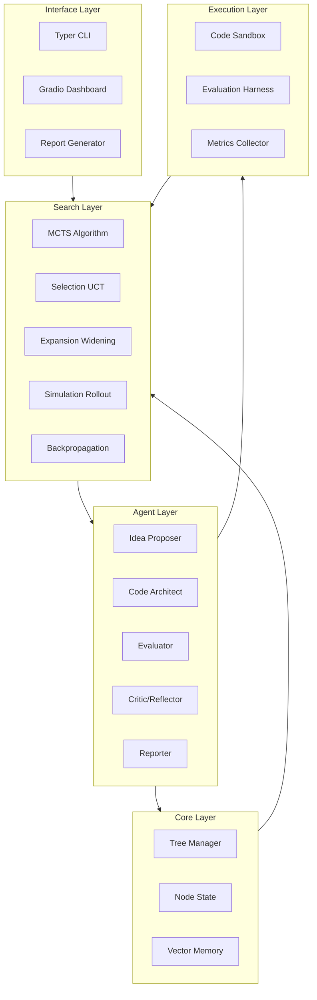
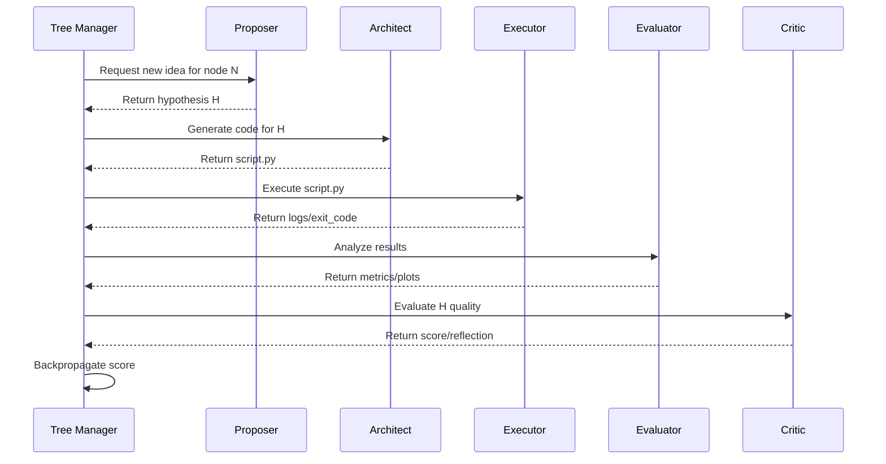

# TreeQuest Lab Architecture

## Overview

TreeQuest Lab is a modular, extensible, and reproducible system for autonomous machine learning research. It implements an Agentic Tree Search algorithm inspired by Sakana AI's AI Scientist-v2, designed to run on consumer hardware.

## Core Philosophy

- **Simplicity**: Prioritize reliable, minimal components over complex abstractions.
- **Transparency**: Every decision, branch, and reflection is logged and traceable.
- **Safety**: Sandboxed execution with strict resource limits and timeouts.
- **Reproducibility**: Deterministic seeds, versioned configs, and resumable runs.

## System Architecture

The system consists of five main layers:

1. **Core Layer**: Manages the search tree structure and node state.
2. **Agent Layer**: Specialized LLM agents for proposing, coding, evaluating, and reflecting.
3. **Search Layer**: Implements Monte Carlo Tree Search (MCTS) with progressive widening.
4. **Execution Layer**: Sandboxed code execution and evaluation harnesses.
5. **Interface Layer**: CLI, visualization, and reporting tools.

## Component Details

### 1. Core Layer

#### Node (`src/core/node.py`)
Represents a single research hypothesis in the search tree.

**Attributes:**
- `hypothesis`: The research idea or method description.
- `code_checkpoint`: Path to generated experiment code.
- `results_dict`: Metrics and outputs from execution.
- `score`: Aggregated value (e.g., novelty + performance).
- `reflections`: Critic feedback and lessons learned.
- `visit_count`, `value_sum`: For UCT calculation.

**Key Methods:**
- `uct_score()`: Calculates Upper Confidence Bound for Trees.
- `backpropagate()`: Updates statistics up the tree.
- `serialize()/deserialize()`: JSON persistence.

#### Tree (`src/core/tree.py`)
Manages the global search tree using NetworkX.

**Features:**
- Progressive widening (limits children per node based on visits).
- Depth and width constraints.
- Duplicate detection via semantic similarity.
- Best path extraction.

### 2. Agent Layer

Agents are implemented as LangGraph nodes or simple Python classes with structured prompting.

| Agent | Role | Input | Output |
|-------|------|-------|--------|
| **Proposer** | Generates novel hypotheses | Tree state, memory | Hypothesis string |
| **Architect** | Writes experiment code | Hypothesis, config | Python script |
| **Evaluator** | Runs metrics/analysis | Code, results | Metrics dict, plots |
| **Critic** | Scores and reflects | Results, hypothesis | Score, reflection text |
| **Reporter** | Writes papers | Full run data | Markdown/LaTeX report |

### 3. Search Layer

Implements a modified MCTS algorithm:

1. **Selection**: Traverse tree using UCT until a leaf is reached.
2. **Expansion**: Add new child nodes (progressive widening limits count).
3. **Simulation**: Run a quick rollout (optional for cheap experiments).
4. **Backpropagation**: Update visit counts and values up the path.

**Progressive Widening Formula:**
$$ C(n) = \lfloor n^\alpha \rfloor $$
Where $n$ is visit count and $\alpha$ is a constant (default 0.5).

### 4. Execution Layer

#### Sandbox (`src/sandbox/executor.py`)
- Executes code in isolated subprocesses.
- Enforces timeouts and memory limits.
- Captures stdout/stderr securely.

#### Evaluation Harness (`src/evaluation/harness.py`)
- Standardized benchmarks (CIFAR-10 subset, GSM8K-small).
- Consistent metric collection (accuracy, loss, FLOPs).
- Plot generation for training curves.

### 5. Interface Layer

- **CLI**: `treequest run`, `status`, `visualize`, `report`.
- **Dashboard**: Real-time tree visualization and run control.
- **Reports**: Auto-generated mini-papers with figures.

## Data Flow

## Configuration

Configuration is managed via `config/hyperparameters.yaml` and environment variables.

**Key Parameters:**
- `max_depth`: Maximum tree depth (default 5).
- `max_width`: Max children per node (dynamic via widening).
- `uct_constant`: Exploration vs exploitation balance.
- `timeout_seconds`: Per-experiment time limit.
- `model_name`: LLM backbone for agents.

## Extensibility

### Adding New Agents
1. Create class in `src/agents/`.
2. Implement `generate()` method with Pydantic output.
3. Register in LangGraph workflow.

### New Benchmarks
1. Add dataset loader in `src/evaluation/harness.py`.
2. Define metric schema.
3. Update config to select benchmark.

### Custom Search Strategies
1. Subclass `Tree` in `src/core/tree.py`.
2. Override `select_node()` method.
3. Pass custom config to runner.

## Safety & Cost Control

- **Sandboxing**: All code runs in restricted subprocesses.
- **Token Limits**: Strict output token caps for LLM calls.
- **Retry Logic**: Exponential backoff for API failures.
- **Dry Run Mode**: Validate pipeline without execution.

## Future Directions

- **Distributed Search**: Multi-node tree exploration.
- **Human-in-the-Loop**: Interactive branching via UI.
- **Meta-Learning**: Learn priors from successful paths.
- **Multi-Modal**: Support vision-language experiments.
